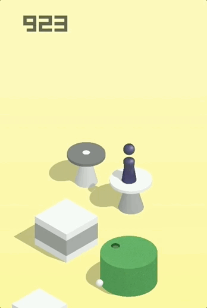

# 教你用 Python 来玩微信跳一跳
## 游戏模式

> 2017 年 12 月 28 日下午，微信发布了 6.6.1 版本，加入了「小游戏」功能，估计是为了推广小程序（登第说的），同时据小道消息，这玩意儿也是抄袭的哟，具体抄谁的，我就不具体说了，想知道的去问老郭或袁渊。

---
>看看该手动的效果，轻轻松松上1000不成问题，但是如果突破了1000就成问题（70%的概率是刷的），我现在已经被微信给拉黑了，分数传不上去，先立个flag：


看看效果：




可能刚开始上手的时候，因为时间距离之间的关系把握不恰当，只能跳出几个就掉到了台子下面。**如果能利用图像识别精确测量出起始和目标点之间测距离，就可以估计按压的时间来精确跳跃。**

## 原理说明

1. 将手机点击到《跳一跳》小程序界面

2. 用 ADB 工具获取当前手机截图，并用 ADB 将截图 pull 上来
```shell
adb shell screencap -p /sdcard/autojump.png
adb pull /sdcard/autojump.png 
```

3. 计算按压时间
  用 Matplotlib 显示截图，用鼠标先点击起始点位置，然后点击目标位置，计算像素距离；

4. 用 ADB 工具点击屏幕蓄力一跳
```shell
adb shell input swipe x y x y time(ms)
```

## 使用教程

- 1.安装numpy、matplotlib、PIL、cv2库

- 2.利用ADB调试方法连接上手机，需要解除手机的usb调试安全设置，然后按照电脑屏幕上的操作步骤即可。

- 3.可以用pycharm、sublime、ipython、cmd-shell等编译执行工具（我用到位cmd-shell）：

